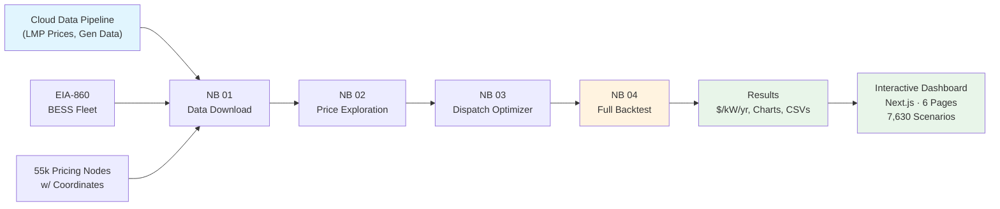
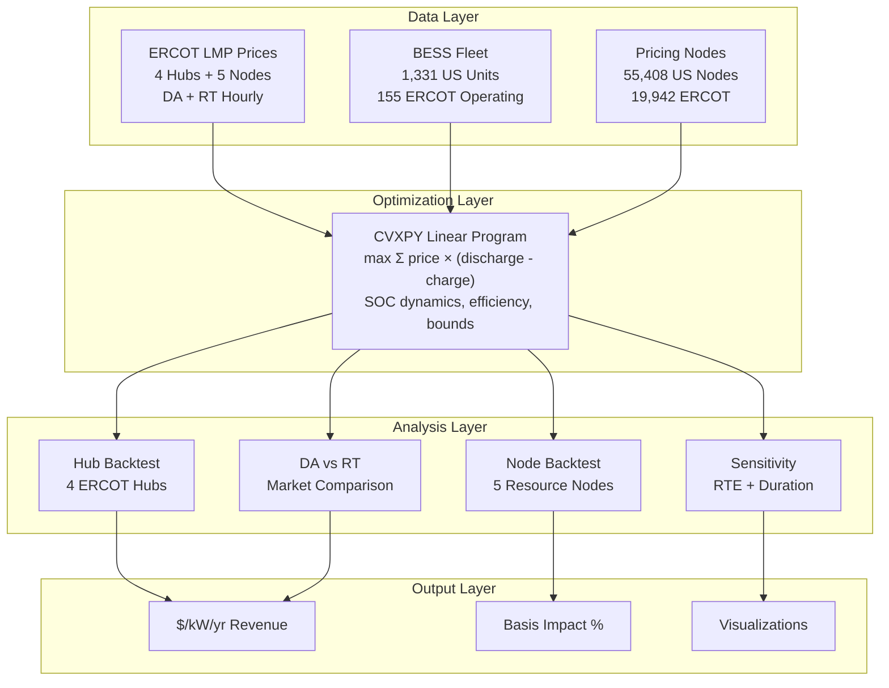
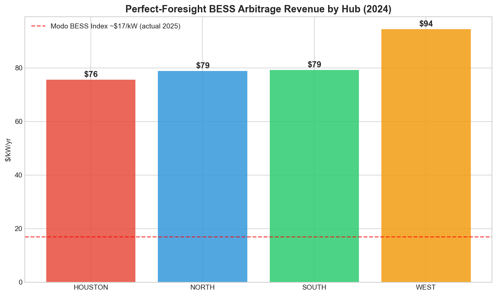
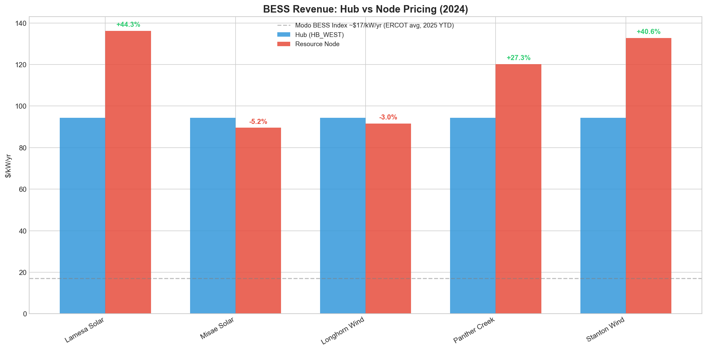
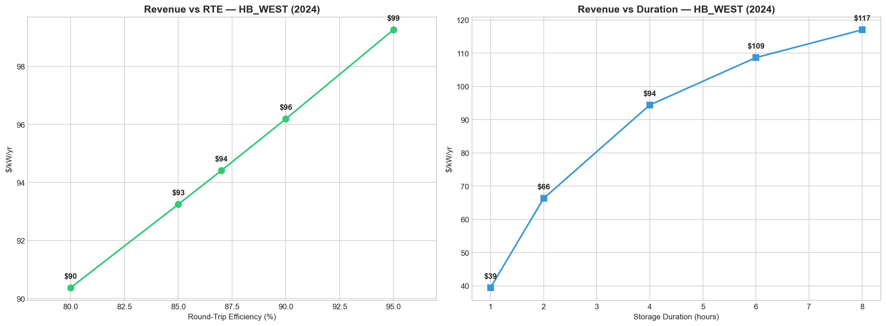
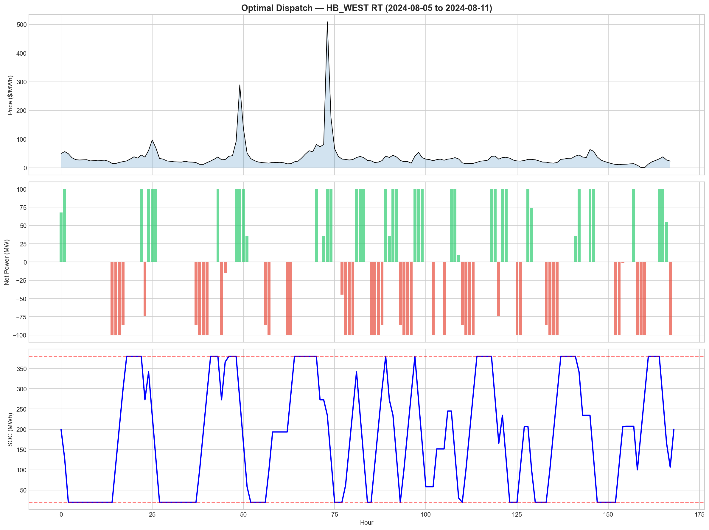
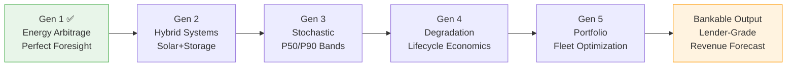

# BESS Energy Arbitrage: ERCOT Hub & Node Analysis

**Modo Energy Open Tech Challenge Submission** | Divy Patel | March 2026

## Point of View

Hub-level BESS revenue analysis systematically misprices battery value. By comparing dispatch optimization at ERCOT hubs versus real generation site nodes, we quantify how much nodal basis, market selection, and asset design actually matter — producing the exact $/kW/yr metric that Modo's customers use to make investment decisions.

---

## Analysis Pipeline





---

## Key Findings (2024 Backtest, 100MW/400MWh LFP)

### Hub Revenue (RT Prices)

| Hub | $/kW/yr | Cycles/yr |
|-----|---------|-----------|
| HB_HOUSTON | $76 | 520 |
| HB_NORTH | $79 | 540 |
| HB_SOUTH | $79 | 518 |
| **HB_WEST** | **$94** | **609** |

### Node Revenue (RT Prices, vs HB_WEST)

| Site | Type | Node $/kW/yr | Basis Impact |
|------|------|-------------|--------------|
| Lamesa Solar | Solar | $136 | **+44%** |
| Stanton Wind | Wind | $133 | **+41%** |
| Panther Creek | Wind | $120 | **+27%** |
| Longhorn Wind | Wind | $92 | -3% |
| Misae Solar | Solar | $90 | -5% |

### DA vs RT Market Comparison

| Hub | RT $/kW/yr | DA $/kW/yr | DA Premium |
|-----|-----------|-----------|------------|
| HOUSTON | $76 | $73 | -3% |
| NORTH | $79 | $76 | -4% |
| SOUTH | $79 | $73 | -7% |
| WEST | $94 | $87 | -8% |

RT consistently outperforms DA under perfect foresight (wider real-time spreads).

### Headline Insights



1. **Capture rate gap:** Perfect foresight yields $76–$136/kW/yr. Modo BESS Index shows ~$17/kW/yr (ERCOT fleet avg, 2025 YTD) — operators capture only **~18% of theoretical maximum**. The gap is dominated by forecasting uncertainty, not market structure. *(Note: Modo comparison is illustrative — different year, asset mix, and methodology than our 2024 backtest.)*

2. **Nodal basis matters:** Resource nodes average **+21% vs hub** revenue. Same region (West TX), dramatically different economics. A developer siting at Lamesa Solar's node earns $136/kW; at Misae Solar's node, only $90/kW. Hub-only analysis masks this $46/kW spread.



3. **4-hour duration is the sweet spot:** 4h captures **81% of 8h revenue** at half the capex. Going from 1h→4h nearly doubles revenue ($39→$94/kW/yr), but 4h→8h adds only $23/kW/yr.



4. **RT > DA for arbitrage:** RT prices yield 3–8% more than DA across all hubs — wider real-time spreads create more arbitrage opportunity under perfect foresight.

5. **Revenue is seasonal:** Top 3 months (May, Aug, Apr) deliver **37%** of annual revenue at HB_WEST. Cash flow planning must account for this concentration.



### What a Modo Customer Learns From This

- **BESS traders:** The 18% capture rate means massive upside from better price forecasting. Each 1% improvement in capture is worth ~$1/kW/yr across a fleet.
- **Asset owners:** Node selection matters as much as hub selection. Due diligence on nodal congestion patterns is essential.
- **Developers:** 4h duration is well-justified by the diminishing returns curve. RTE improvements (80%→95%) add ~$9/kW/yr — chemistry selection has real revenue impact.
- **Project finance:** Single-year revenue varies significantly. A bankable model needs multi-year stochastic analysis ([Gen 3 roadmap](docs/solution/way_ahead.md#4-gen-3-stochastic-modeling--risk-quantification)).

---

## Interactive Dashboard

> ### **[Live Demo → dbessmodo.vercel.app](https://dbessmodo.vercel.app)**
>
> 6 pages · 9 locations · 7,630 scenarios · Configurable BESS parameters · Dark/light theme

The full analysis is available as an interactive Next.js dashboard with 6 pages, configurable BESS parameters, and 7,630 pre-computed dispatch scenarios:

- **Overview** — KPIs with rankings, revenue heatmaps, monthly distributions
- **Explorer** — Price duration curves, monthly stats, volatility analysis
- **Sensitivity** — RTE × Duration revenue surface (interactive heatmap)
- **Dispatch** — Hour-by-hour optimal charge/discharge profiles
- **Colocation** — Hub vs node basis analysis for 5 renewable sites
- **Registry** — US BESS fleet map + searchable table (1,331 units)

Sidebar controls let you adjust location (9 nodes/hubs), market (DA/RT), RTE (78–95%), duration (1–8h), and year (2010–2025). URL params are shareable. Vision placeholders show the Gen 2–5 roadmap.

---

## Quick Start

```bash
python -m venv .venv && source .venv/bin/activate
pip install -r requirements.txt

# Notebooks are pre-executed with all outputs saved
jupyter lab notebooks/
```

**Reviewers:** All notebook outputs are pre-saved — you can view results immediately without re-running. NB 02–04 use only the pre-committed `data/` files and do not require cloud access. Only NB 01 (data download) requires the production cloud data pipeline; reviewers can skip it entirely.

To re-run from scratch, you'll need access to the production cloud data pipeline for price data (see NB 01 for details). As a fallback, ERCOT prices can be obtained via the open-source [gridstatus](https://github.com/kmax12/gridstatus) library.

```bash
# Run tests
pytest tests/ -v

# Run the interactive dashboard
cd src/dashboard && npm install && npm run dev
# → http://localhost:3000
```

---

## Project Structure

> Click any link to navigate directly to the file.

```
BESS_modo/
├── notebooks/
│   ├── 01_data_download.ipynb ............. Download ERCOT LMP prices + validate
│   ├── 02_price_exploration.ipynb ......... Price stats, volatility, basis risk
│   ├── 03_dispatch_optimizer.ipynb ........ CVXPY LP optimizer + 5 sanity tests
│   ├── 04_backtest_colocation.ipynb ....... Full backtest + DA/RT + sensitivity
│   └── html/ .............................. Static HTML renders (no Jupyter needed)
├── data/
│   ├── bess_enriched.parquet .............. 1,331 US BESS units (EIA-860)
│   ├── results/ ........................... Backtest outputs + charts
│   ├── prices/ ............................ ERCOT LMP parquets (not tracked)
│   ├── revenue/ ........................... Gen revenue by site (not tracked)
│   ├── generation/ ........................ Solar/wind gen data (not tracked)
│   └── extra/ ............................. Schema docs, 55k nodes (not tracked)
├── docs/
│   ├── problem_statement/
│   │   ├── BESS_Hybrid_Storage_Problem_Statement.md ... Why this problem matters
│   │   └── BESS_Problem_Statement_Report.pdf .......... Formal PDF version
│   ├── solution/
│   │   ├── methodology.md ................ LP formulation, assumptions, validation
│   │   ├── way_ahead.md .................. Gen 2-5 roadmap, extensions, value prop
│   │   └── ai_usage.md ................... AI tools, workflow, contribution
│   ├── plan/
│   │   └── README.md ..................... Agent planning workflow
│   └── extra/
│       └── README.md ..................... Research & context (gitignored content)
├── src/
│   ├── bess/
│   │   ├── __init__.py
│   │   └── optimizer.py ................. optimize_dispatch() + backtest_year()
│   └── dashboard/ ......................... Interactive Next.js dashboard
│       ├── app/ ........................... 6 page routes (overview, explorer, etc.)
│       ├── components/ .................... 25+ React components
│       ├── lib/ ........................... Data loading, scenario matrix, exports
│       ├── public/data/ ................... Pre-computed JSON (7,630 scenarios)
│       └── scripts/ ....................... Python data preparation scripts
├── tests/
│   └── test_optimizer.py ................ 5 pytest tests (from NB 03 sanity checks)
├── resume/
│   ├── Divy_Patel_Resume_Modo.pdf
│   └── Divy_Patel_CoverLetter_Modo.pdf
└── requirements.txt
```

| Directory | What's Inside | Tracked |
|-----------|--------------|---------|
| [`notebooks/`](notebooks/) | 4 Jupyter notebooks — the primary deliverable | Yes |
| [`notebooks/html/`](notebooks/html/) | Static HTML renders of all notebooks (no Jupyter needed) | Yes |
| [`data/results/`](data/results/) | Revenue CSVs, sensitivity CSVs, 7 chart PNGs | Yes |
| [`data/bess_enriched.parquet`](data/) | EIA-860 enriched BESS fleet (1,331 units) | Yes |
| `data/prices/` | ERCOT LMP parquets (85 MB, 4 hubs + 5 nodes) | No — re-downloadable |
| `data/extra/` | Schema docs, pricing node coordinates | No — [see README](data/extra/README.md) |
| [`docs/problem_statement/`](docs/problem_statement/) | Problem statement (MD + PDF) | Yes |
| [`docs/solution/`](docs/solution/) | Methodology, roadmap, AI usage | Yes |
| [`src/bess/`](src/bess/) | Optimizer module (importable from notebooks + tests) | Yes |
| [`src/dashboard/`](src/dashboard/) | Next.js 15 interactive dashboard (6 pages, 7,630 scenarios) | Yes |
| [`tests/`](tests/) | 5 pytest tests for dispatch optimizer | Yes |
| [`resume/`](resume/) | Resume + cover letter | Yes |

---

<details>
<summary><strong>Methodology</strong> (click to expand)</summary>

**Full details:** [docs/solution/methodology.md](docs/solution/methodology.md)

### Dispatch Optimization
Linear program (CVXPY/CLARABEL) with perfect price foresight:
- **Asset:** 100 MW / 400 MWh (4-hour), 87% RTE (LFP), SOC bounds 5–95%
- **Objective:** Maximize `Σ price[t] × Δt × (discharge[t] - charge[t])`
- **Efficiency:** √RTE split (η_ch = η_dis = 0.933)
- **Backtest:** Monthly rolling optimization (cyclic SOC per month), hourly resolution

### Data Sources
- **LMP Prices:** ERCOT hub + resource node prices from production cloud data pipeline. Raw SPP (not forecast-compressed) — preserves $9k spikes critical for arbitrage valuation.
- **BESS Fleet:** EIA-860 enriched (1,331 US units, 155 ERCOT operating, 10,105 MW)
- **Pricing Nodes:** 55,408 US ISO nodes with lat/long (19,942 ERCOT)

### Validation
5 sanity tests on optimizer (synthetic prices, flat prices, revenue >= 0, SOC bounds, RTE monotonicity). Results benchmarked against Modo BESS Index.

</details>

<details>
<summary><strong>What Differentiates This</strong> (click to expand)</summary>

| Aspect | This Submission | Typical Analysis |
|--------|----------------|-----------------|
| Pricing | Hub + 5 resource nodes | Hub only |
| Basis quantification | Node-level $/kW/yr + % impact | Not analyzed |
| Markets | DA + RT comparison | Usually RT only |
| Sensitivity | RTE + duration sweeps | Fixed parameters |
| Data infrastructure | Production cloud pipeline, 55k nodes | CSV downloads |
| Metric | $/kW/yr (Modo's BESS Index) | Total $ or $/MWh |
| Co-location | Real solar/wind sites with gen revenue | Hypothetical |

</details>

<details>
<summary><strong>Limitations</strong> (click to expand)</summary>

- Perfect foresight = theoretical upper bound (not achievable)
- No ancillary services, degradation, or transaction costs
- Single-year (2024); multi-year needed for regime sensitivity
- No behind-the-meter or shared interconnection constraints
- No DA+RT co-optimization (each market analyzed independently)
- Energy arbitrage only — does not capture ancillary, capacity, or contract revenues

</details>

---

## Roadmap (Gen 2–5)

**Full details:** [docs/solution/way_ahead.md](docs/solution/way_ahead.md)



| Gen | Adds | Key Output |
|-----|------|-----------|
| **1** (delivered) | Perfect-foresight energy arbitrage | $/kW/yr upper bound, basis impact |
| **2** | Hybrid solar+storage coupling, export constraints | Co-location revenue impact |
| **3** | Price scenarios, Monte Carlo, uncertainty bands | P50/P90 revenue, DSCR |
| **4** | Cycle counting, capacity fade, chemistry comparison | Lifecycle NPV |
| **5** | Multi-asset, cross-node portfolio optimization | Fleet-level risk metrics |

---

## Documentation

| Document | Description |
|----------|-------------|
| [Problem Statement](docs/problem_statement/BESS_Hybrid_Storage_Problem_Statement.md) | Why BESS financial modeling matters — market context, competitive landscape, foundational infrastructure |
| [Problem Statement (PDF)](docs/problem_statement/BESS_Problem_Statement_Report.pdf) | Formal PDF version |
| [Methodology](docs/solution/methodology.md) | LP formulation, asset assumptions, data provenance, validation, industry comparison |
| [Way Ahead](docs/solution/way_ahead.md) | Gen 2-5 roadmap, ancillary services, hybrid systems, degradation, value prop for plant owners |
| [AI Usage](docs/solution/ai_usage.md) | Claude Code workflow, debugging examples, AI vs human contribution |
| [Planning Workflow](docs/plan/README.md) | Agent planning workflow and conventions |

## Infrastructure

This submission combines **analytical depth** with a **production-grade interactive dashboard**. The Jupyter notebooks provide the analytical foundation; the Next.js dashboard makes the results explorable with configurable parameters across 7,630 pre-computed scenarios. Deployed on Vercel with static JSON data — no backend required.
